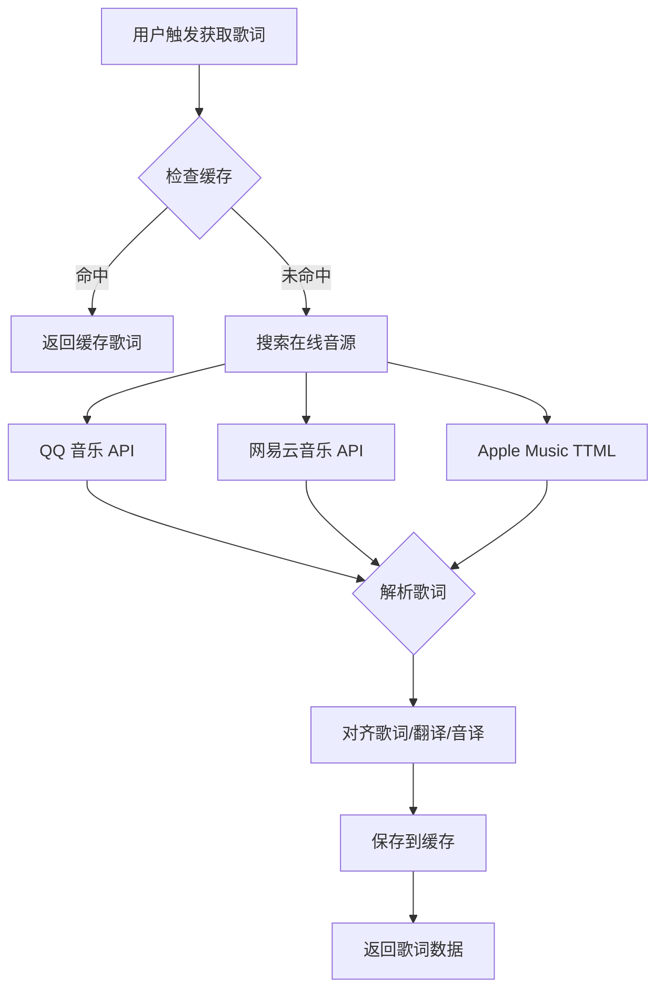
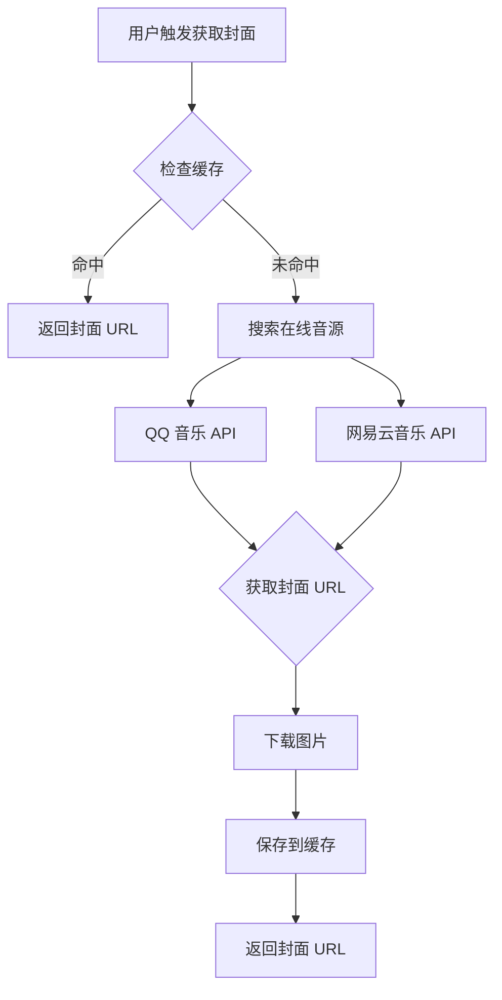

# 在线音乐服务设计文档

**创建日期：** 2026-04-25  
**版本：** 1.0  
**状态：** 已批准  

---

## 1. 概述

### 1.1 目标

为 TPlayer 添加在线音乐元数据获取能力，包括：
- 在线搜索歌曲（支持 QQ 音乐、网易云音乐、Apple Music TTML）
- 获取歌词（支持 LRC、QRC、TTML、YRC 格式）
- 获取封面图片（静态 + 动态）
- 本地音频文件元数据读取
- 缓存管理（本地文件缓存）

### 1.2 设计原则

- **轻量级集成**：最小化对现有架构的修改
- **前端优先**：元数据解析在前端完成，减少 Rust 后端复杂度
- **缓存优先**：避免重复网络请求，提升用户体验
- **渐进增强**：不影响现有本地播放功能

---

## 2. 架构设计

### 2.1 系统架构

```
┌─────────────────────────────────────────────────────────┐
│                    TPlayer 应用                          │
├─────────────────────────────────────────────────────────┤
│  前端 (TypeScript/Vue)                                   │
│  ┌─────────────────────────────────────────────────┐    │
│  │ onlineMusicService.ts (新增)                     │    │
│  │ ├─ 搜索歌曲 (QQ/网易云/Apple Music)              │    │
│  │ ├─ 获取歌词 (LRC/QRC/TTML/YRC)                   │    │
│  │ ├─ 获取封面 (静态/动态)                          │    │
│  │ └─ 缓存管理 (IndexedDB + Tauri FS)               │    │
│  └─────────────────────────────────────────────────┘    │
│  ┌─────────────────────────────────────────────────┐    │
│  │ music-metadata-browser (读取本地元数据)          │    │
│  └─────────────────────────────────────────────────┘    │
│  ┌─────────────────────────────────────────────────┐    │
│  │ musicDataService.ts (扩展)                       │    │
│  │ └─ 集成 onlineMusicService                       │    │
│  └─────────────────────────────────────────────────┘    │
├─────────────────────────────────────────────────────────┤
│  Tauri 后端 (Rust)                                      │
│  ┌─────────────────────────────────────────────────┐    │
│  │ commands_cache.rs (新增)                         │    │
│  │ ├─ save_to_cache                                 │    │
│  │ ├─ get_cached_file                               │    │
│  │ ├─ clear_cache                                   │    │
│  │ └─ get_cache_dir                                 │    │
│  └─────────────────────────────────────────────────┘    │
└─────────────────────────────────────────────────────────┘
```

### 2.2 数据流

#### 2.2.1 歌词获取流程



#### 2.2.2 封面获取流程



---

## 3. API 设计

### 3.1 音源 API

#### 3.1.1 QQ 音乐（通过 LX Music API）

```typescript
// 搜索歌曲
GET https://api.lxmusic.top/qq/search/{keyword}?page=1&limit=20

// 获取歌词
GET https://api.lxmusic.top/qq/lyric/{songId}
// 返回：{ qrc, lrc, trans, roma, song: { duration }, code }

// 获取封面
GET https://api.lxmusic.top/qq/cover/{songId}
// 返回：{ coverUrl, code }
```

#### 3.1.2 网易云音乐

```typescript
// 搜索歌曲
POST https://music.163.com/api/search/get
Body: { s: keyword, type: 1, page: 1, limit: 20 }

// 获取歌词
GET https://music.163.com/api/song/lyric/v1?id={id}
// 返回：{ lrc, tlyric, romalrc, yrc, ytlrc, yromalrc, code }

// 获取歌曲详情（含封面）
GET https://music.163.com/api/song/detail?ids={id}
// 返回：{ songs: [{ al: { picUrl } }], code }

// 动态封面
GET https://music.163.com/api/song/dynamic/cover?id={id}
// 返回：{ data: { videoPlayUrl }, code }
```

#### 3.1.3 Apple Music TTML

```typescript
// 获取 TTML 歌词
GET https://amll.nyakku.moe/ttml/{songId}.ttml
// 返回：TTML XML 格式
```

### 3.2 缓存管理 API（Rust）

```rust
// 保存文件到缓存目录
#[tauri::command]
async fn save_to_cache(
    app_handle: AppHandle,
    category: String,  // "lyrics" | "covers" | "metadata"
    filename: String,
    data: Vec<u8>,
) -> Result<String, String>

// 从缓存读取文件
#[tauri::command]
async fn get_cached_file(
    app_handle: AppHandle,
    category: String,
    filename: String,
) -> Result<Vec<u8>, String>

// 获取缓存目录路径
#[tauri::command]
async fn get_cache_dir(
    app_handle: AppHandle,
    category: String,
) -> Result<String, String>

// 清理过期缓存
#[tauri::command]
async fn clear_cache(
    app_handle: AppHandle,
    category: String,
    older_than_days: u64,
) -> Result<usize, String>
```

---

## 4. 数据结构

### 4.1 核心类型定义

```typescript
// 在线歌曲信息
export interface OnlineSong {
  id: string
  title: string
  artist: string
  album: string
  duration: number
  coverUrl: string
  source: 'qq' | 'netease' | 'amll'
}

// 歌词结果
export interface LyricResult {
  lrcData: LyricLine[]
  yrcData: LyricLine[]
  source: 'qq' | 'netease' | 'amll'
  hasTranslation: boolean
  hasRomanization: boolean
}

// 缓存元数据
export interface CacheMetadata {
  key: string
  category: 'lyrics' | 'covers' | 'metadata'
  source: string
  size: number
  createdAt: number
  lastAccessedAt: number
  accessCount: number
}
```

### 4.2 缓存目录结构

```
AppDataDir/
└─ cache/
   ├─ lyrics/
   │  ├─ qq_{songId}.json
   │  ├─ netease_{id}.json
   │  └─ ttml_{id}.ttml
   ├─ covers/
   │  ├─ qq_{songId}_{size}.jpg  (size: s/m/l/xl)
   │  └─ netease_{id}_{size}.jpg
   ├─ metadata/
   │  └─ index.json (缓存索引)
   └─ README.md
```

---

## 5. 缓存策略

### 5.1 歌词缓存

- **存储方式**：JSON 文件（包含原始数据 + 解析后数据）
- **保留策略**：永久保留（除非用户手动清理）
- **缓存键**：`{source}_{songId}`

### 5.2 封面缓存

- **存储方式**：JPEG 文件
- **保留策略**：LRU 淘汰（最多 100 张，超过时删除最少访问的）
- **缓存键**：`{source}_{songId}_{size}`
- **清理触发**：每次访问时更新 `lastAccessedAt`

### 5.3 缓存索引

使用 `index.json` 维护缓存元数据：

```json
{
  "version": 1,
  "lastCleanup": 1714032000000,
  "entries": {
    "qq_12345_l": {
      "category": "covers",
      "size": 102400,
      "createdAt": 1714032000000,
      "lastAccessedAt": 1714118400000,
      "accessCount": 5
    }
  }
}
```

---

## 6. UI 集成

### 6.1 标签编辑对话框增强

在现有标签编辑界面添加"在线匹配"区域：

```vue
<div class="online-match-section">
  <div class="search-box">
    <input 
      v-model="searchKeyword" 
      placeholder="搜索歌曲..."
      @keyup.enter="searchOnline"
    />
    <button @click="searchOnline" :disabled="searching">
      {{ searching ? '搜索中...' : '搜索' }}
    </button>
  </div>
  
  <!-- 搜索结果 -->
  <div v-if="searchResults.length > 0" class="search-results">
    <div 
      v-for="result in searchResults" 
      :key="result.id"
      :class="['result-item', { selected: selectedResult?.id === result.id }]"
      @click="selectResult(result)"
    >
      
      <div class="result-info">
        <div class="result-title">{{ result.title }}</div>
        <div class="result-artist">{{ result.artist }}</div>
        <div class="result-album">{{ result.album }}</div>
      </div>
      <div class="result-source">{{ result.source }}</div>
    </div>
  </div>
</div>

<!-- 操作按钮 -->
<div class="action-buttons">
  <button @click="getLyrics" :disabled="!selectedResult">获取歌词</button>
  <button @click="getCover" :disabled="!selectedResult">获取封面</button>
  <button @click="applyAll" :disabled="!selectedResult">应用全部</button>
</div>
```

### 6.2 歌词来源显示

在歌词显示组件底部添加来源标识：

```vue
<div class="lyric-source">
  <span class="source-badge" :class="lyricSource">
    {{ sourceText }}
  </span>
  <button @click="showSourceSelector" class="switch-btn">
    切换源
  </button>
</div>
```

---

## 7. 错误处理

### 7.1 网络错误

- **策略**：重试 3 次（指数退避：1s, 2s, 4s）
- **降级**：所有音源失败时，提示用户检查网络
- **缓存**：即使 API 失败，也尝试使用缓存

### 7.2 匹配失败

- **策略**：使用相似度算法（Levenshtein 距离）
- **阈值**：相似度 < 0.6 视为不匹配
- **提示**：显示"未找到匹配结果，请尝试手动搜索"

### 7.3 缓存错误

- **策略**：缓存失败不影响主流程
- **日志**：记录错误到控制台
- **降级**：直接使用网络数据

---

## 8. 性能优化

### 8.1 搜索优化

- **防抖**：搜索输入防抖 300ms
- **缓存搜索结果**：相同关键词直接返回
- **并发限制**：最多同时搜索 2 个音源

### 8.2 图片优化

- **尺寸选择**：根据显示区域选择合适尺寸
  - 列表视图：s (150x150)
  - 播放器：l (500x500)
  - 全屏：xl (1000x1000)
- **懒加载**：不可见时不加载
- **渐进式加载**：先加载缩略图，再加载高清图

### 8.3 歌词解析优化

- **Web Worker**：在后台线程解析长歌词
- **增量渲染**：逐行显示解析结果
- **缓存解析结果**：避免重复解析

---

## 9. 依赖项

### 9.1 前端依赖

```json
{
  "dependencies": {
    "music-metadata-browser": "^2.5.0",
    "localforage": "^1.10.0"
  }
}
```

### 9.2 Rust 依赖

无需新增（使用现有 Tauri 插件）：
- `tauri-plugin-fs` (已安装)
- `tauri-plugin-dialog` (已安装)

---

## 10. 测试策略

### 10.1 单元测试

- 搜索算法测试
- 歌词解析测试
- 缓存管理测试
- 相似度计算测试

### 10.2 集成测试

- API 调用测试（mock）
- 缓存读写测试
- 元数据读取测试

### 10.3 E2E 测试

- 在线匹配流程测试
- 标签编辑流程测试
- 歌词显示流程测试

---

## 11. 安全考虑

### 11.1 API 调用

- **频率限制**：同一 IP 每秒最多 5 次请求
- **用户代理**：使用标准浏览器 UA
- **Referer**：设置正确的 Referer 头

### 11.2 缓存安全

- **文件验证**：读取缓存前验证文件完整性
- **大小限制**：单个缓存文件最大 10MB
- **清理机制**：定期清理过期文件

### 11.3 隐私保护

- **不收集用户数据**：仅本地缓存
- **不上传文件**：仅读取元数据
- **可清除缓存**：提供一键清理功能

---

## 12. 未来扩展

### 12.1 可能的增强

- [ ] 支持更多音源（KuGou、Kuwo）
- [ ] 歌词翻译（AI 翻译）
- [ ] 封面 AI 修复（超分辨率）
- [ ] 离线模式（完全本地匹配）

### 12.2 暂不实现

- [ ] 在线播放（版权风险）
- [ ] 下载歌曲（法律风险）
- [ ] 用户账户系统（复杂度过高）

---

## 13. 参考文档

- [Splayer 项目](https://github.com/ChrisHcn1/Splayer) - 参考实现
- [music-metadata-browser](https://github.com/Borewit/music-metadata-browser) - 元数据解析
- [LX Music API](https://github.com/lyswhut/lx-music-api) - QQ 音乐 API
- [网易云音乐 API](https://github.com/Binaryify/NeteaseCloudMusicApi) - 网易云 API
- [amll-db](https://github.com/Steve-xmh/amll-db) - Apple Music TTML 数据库

---

**文档结束**
